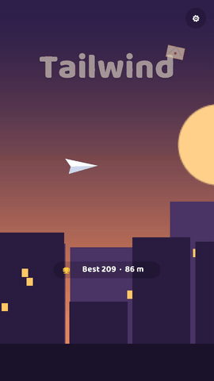
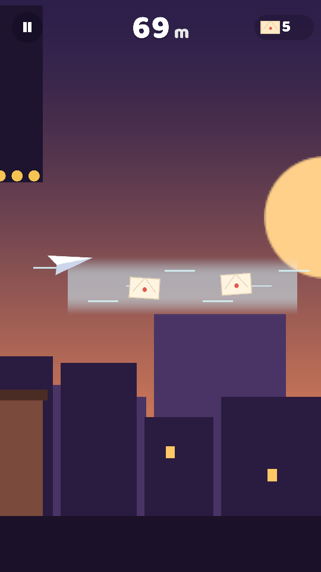
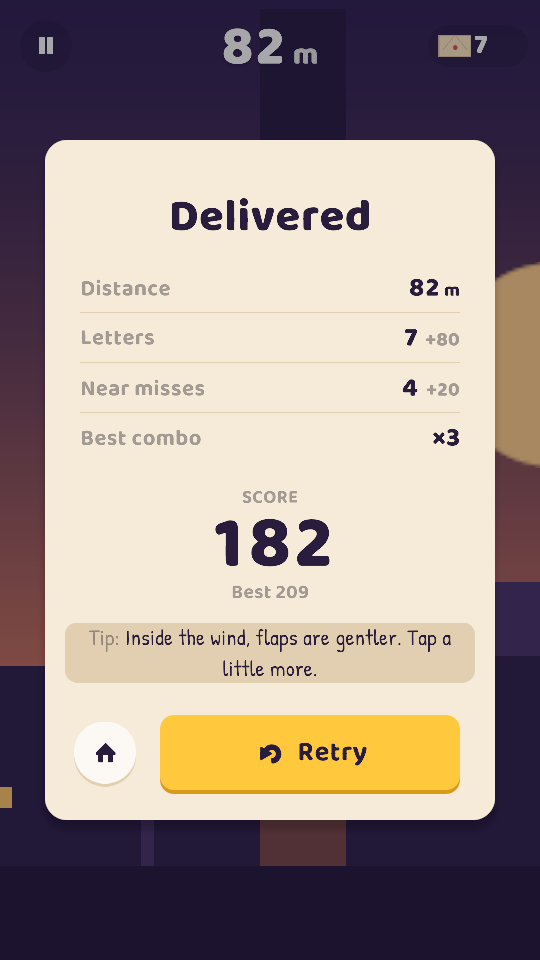

# Tailwind

*A Flappy Bird-style mobile game with a drafting twist.* Mây, a paper glider, delivers letters across
the rooftops of Gióng Town at dusk. Tap to flap, and ride the **wind streams** to glide faster and build
a combo, the way a cyclist drafts behind a rival.

> **Status (Oct 2026):** first playable preview. All 60 EditMode tests pass in Unity 6.3 LTS, and a
> PlayMode smoke test boots the real game and flies it with the autopilot through a crash and the results
> screen. The screenshots below come from that test.

**Play it:** download the Android APK (7.1+, ARM64) or the Windows zip from
[Releases](https://github.com/tranvantruongdev/tailwind/releases).

<p>
  
  
  
</p>

*The GIF and screenshots are recorded by PlayMode tests, with the autopilot flying (`Tools/make-gif.ps1`).*

| | |
|---|---|
| **Inspired by** | Flappy Bird (tap to flap, endless obstacles) |
| **Twist** | Wind-stream drafting: lower gravity, more speed, a ×1–×5 combo, letters worth 10 × combo |
| **My role** | Solo: design, code, tuning. Art and sound are generated in code for now |
| **Engine** | Unity 6.3 LTS (URP 2D), C#. Built from [unity-mobile-template](https://github.com/tranvantruongdev/unity-mobile-template) |

## How it plays

- **Tap** (or Space) to flap. Chimneys rise from below and lantern lines hang from above; fly through the gaps.
- **Wind streams** (pale bands) lower gravity, speed you up, and make flaps gentler, so you can ride them.
  Every 0.5 s in a stream raises the combo (up to ×5); it lapses 1 s after you leave.
- **Letters** score 10 × combo. **Near misses** (within 0.25 m of a chimney) give +5.
- Speed ramps from 3 to 5 m/s and gaps shrink from 3.2 to 2.6 m over the first 600 m.
- Story beats unlock at 100, 300, 600 and 1,000 m.

## How it's built

```
Assets/_Game/Scripts/Core/      game rules in pure C# (no UnityEngine): GliderRun, Course, ChunkLibrary,
                                Difficulty, StoryBeats, AutopilotBot
Assets/_Game/Scripts/Runtime/   Unity side: RunController, views (glider, course, parallax), HUD, title,
                                procedural sprites and sounds
Assets/_Game/Tests/EditMode/    the same tests run in Unity and with dotnet
Assets/_Game/Tests/PlayMode/    smoke test: boot → title → autopilot run → crash → results → title
Assets/_Project/                shared template: boot flow, saves, audio, haptics, UI stack, game feel
```

- **Deterministic simulation:** `GliderRun.Step(dt)` advances the whole game in pure C# and returns
  events (flap, combo, letter, near miss, crash…) that the view turns into sound, haptics and particles.
  Same seed and same inputs give the same run.
- **Courses from hand-made chunks:** ten chunks in three difficulty tiers, picked by distance with a seeded
  random generator. Fully random layouts produce impossible spots; chunks keep it fair.
- **Fairness rules found by a bot:** an autopilot plays the generated courses in the tests. Its crashes
  exposed unfair junctions between chunks, which led to two rules the generator now enforces:
  1. Height change ≤ 0.4 m per metre of open air between chimneys.
  2. Consecutive gaps must share at least one flap's lift (~1.17 m) of safe height, or have ≥ 4 m of air
     between them.

  A one-off probe of 100 seeds × 1,000 m gave 0 crashes.
- **UI built in code from one theme:** TextMeshPro with Baloo 2 and Patrick Hand (static atlases that include
  every Vietnamese letter), rounded 9-sliced shapes drawn at runtime, buttons that react when the finger goes
  down (scale, tick, haptic), and screens pinned to the safe area's edges. A PlayMode test captures every
  screen at 9:16, 20:9 and 4:3.

```bash
dotnet test Tools/GameTests/Tailwind.Core.Tests.csproj   # game rules, ~2 s
dotnet test Tools/CoreTests/Template.Core.Tests.csproj   # template core
```

In Unity (headless, Windows):

```bash
powershell -ExecutionPolicy Bypass -File Tools/run-unity-tests.ps1                              # 60 EditMode tests
powershell -ExecutionPolicy Bypass -File Tools/run-unity-tests.ps1 -TestPlatform PlayMode -Graphics  # smoke test + screenshots in Logs/screenshots
```

## Credits

Built with AI assistance (Claude Code). I designed the systems, reviewed and tested all code.
Libraries: UniTask (MIT), PrimeTween, Newtonsoft JSON (MIT).
Fonts: [Baloo 2](https://github.com/EkType/Baloo2) and Patrick Hand (SIL Open Font License, see `Assets/_Game/Fonts/OFL-*.txt`).
Icons: [Kenney Game Icons](https://kenney.nl/assets/game-icons) (CC0).
